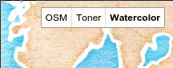

# Leaflet layerscontrol buttons

Simple and compact leaflet layers control composed of a button for each layer, similar to the Google maps API used to use.



## Usage

After including leaflet, include these two `leaflet-layerscontrol-buttons` files.
```html
<link rel="stylesheet" href="leaflet-layerscontrol-buttons.css" />
<script src="leaflet-layerscontrol-buttons.js"></script>
```

And use it like you would use `L.Control.Layers`, omitting the `overlays` argument:

```Javascript
var layersControl = L.control.layers.buttons({
    'OSM': L.tileLayer('http://{s}.tile.openstreetmap.org/{z}/{x}/{y}.png'),
    'Toner': L.tileLayer('http://{s}.tile.stamen.com/toner/{z}/{x}/{y}.png'),
    'Watercolor': L.tileLayer('http://{s}.tile.stamen.com/watercolor/{z}/{x}/{y}.jpg')
}).addTo(map);

// attribution omitted for the example, remember to attribute!
```
